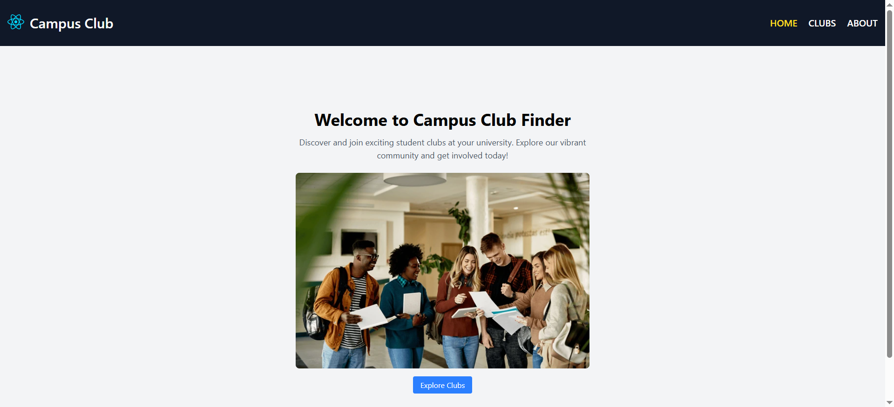
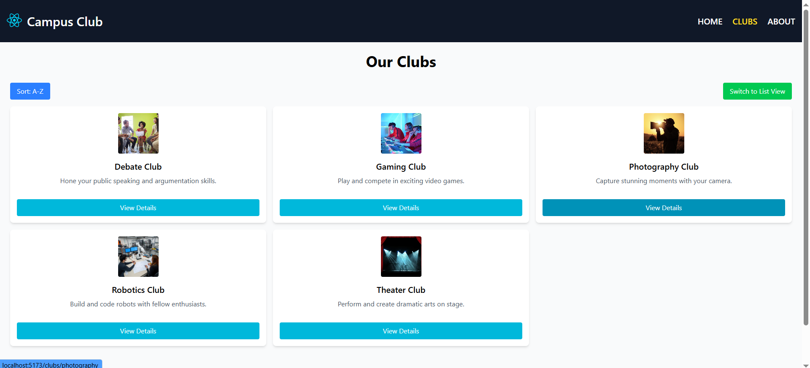
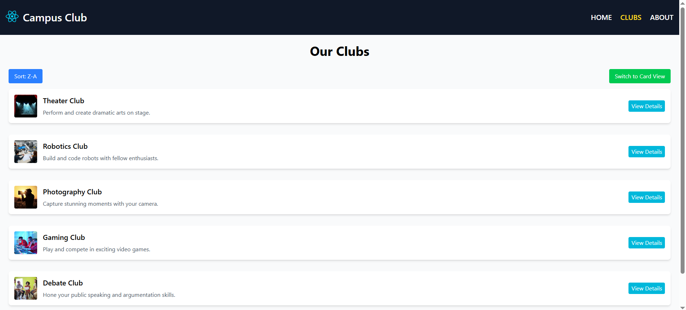
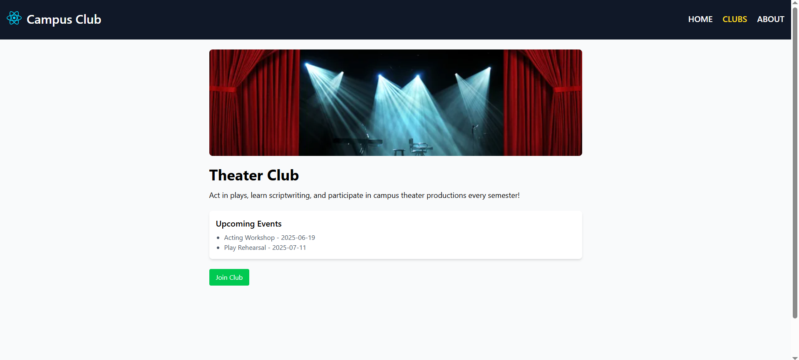
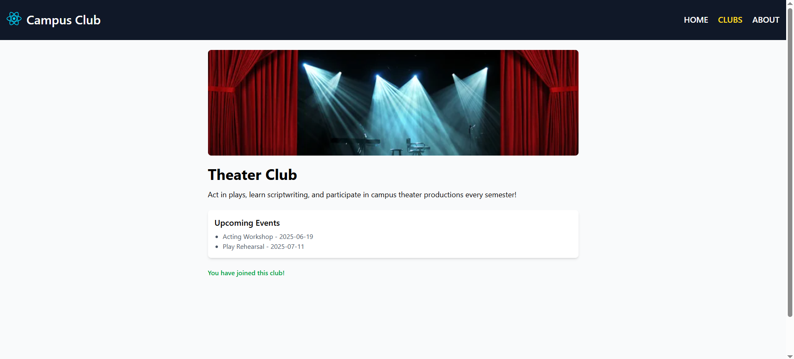
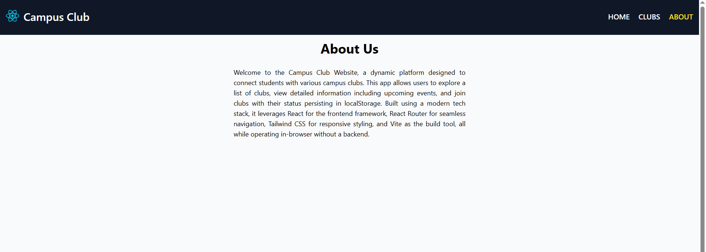

# Campus Club Finder Documentation

## Overview
This web app, built for the university's Student Affairs department, helps students discover, learn about, and join campus clubs. It’s a single-page application using Vite, React, React Router, and Tailwind CSS.

## Setup Instructions
1. Clone the repository: `git clone <your-repo-url>`
2. Install dependencies: `npm install`
3. Start the server: `npm run dev`
4. Open `http://localhost:5173` in your browser.

## Walkthrough with Screenshots

### 1. Home Page (/)
- **Description**: Welcomes users with a brief description and a hero image, featuring an "Explore Clubs" button.
- **Screenshot**: 
- **Features**: Click "Explore Clubs" to navigate to `/clubs`.

### 2. Club List Page (/clubs)
- **Description**: Displays 5 clubs as cards with sorting (A-Z/Z-A) and view toggle (Grid/List).
- **Screenshot**: 
- **Screenshot**: 
- **Features**: 
  - Toggle between Grid and List views.
  - Sort by Name A-Z or Z-A.
  - Click "View Details" to go to `/clubs/:clubId`.

### 3. Club Detail Page (/clubs/:clubId)
- **Description**: Shows club name, big image, description, upcoming events, and "Join Club" button.
- **Screenshot**: 
- **Screenshot**: 
- **Features**: 
  - Join a club (stores in localStorage, shows confirmation).
  - Displays "You have joined this club!" after joining.

### 4. About Page (/about)
- **Description**: Explains the app’s purpose and tech stack.
- **Screenshot**: 
- **Features**: Static content with app description.

### 5. 404 Page (/*)
- **Description**: Displays a friendly not found message with a home link.
- **Screenshot**: 
- **Features**: Click home link to return to `/`.

## Notes
- Data persists in localStorage with no backend.
- Images in relation to club data must be in `src/images/`.
- Images of general use are to be stored in `src/assets/`.
- Ensure Tailwind CSS is configured for styling.